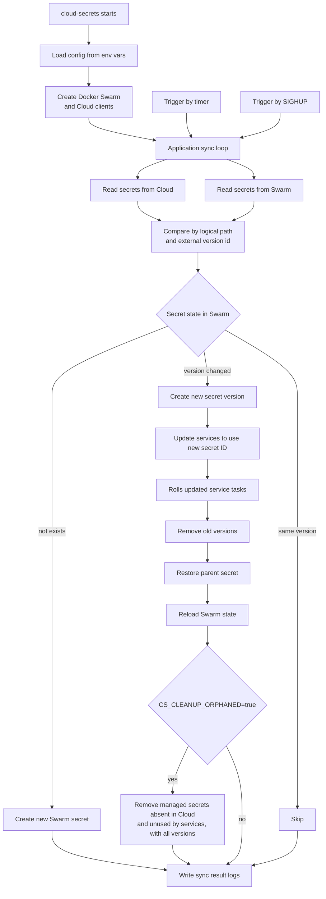

# cloud-secrets

**cloud-secrets** - background service for update secrets in Docker Swarm cluster

Supported cloud providers:
- [Cloud.ru Secret Manager](./docs/usage_cloudru.md)

## How it works

## Monitoring
- [Grafana dashboard](grafana-dashboard.json)
