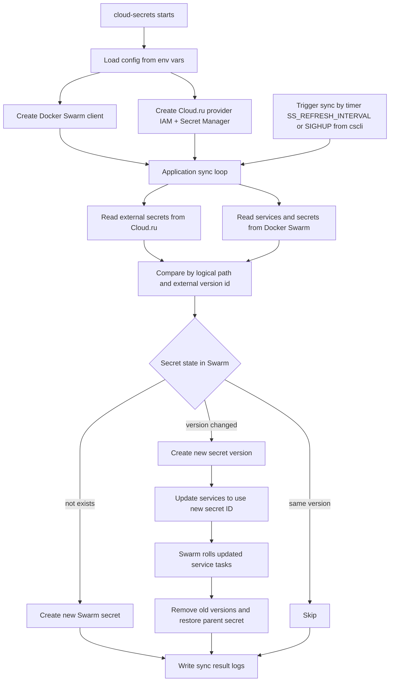

# cloud-secrets

**cloud-secrets** - background service for update secrets in Docker Swarm cluster

Supported cloud providers:
- [Cloud.ru](https://cloud.ru/docs/scsm/ug/index)

## How it works



## Usage

### Usage with Cloud.ru

#### Create IAM secrets
```
echo "<client-id>" > iam_id
echo "<client-secret>" > iam_secret

docker secret create iam_id ./iam_id
docker secret create iam_secret ./iam_secret
```

##### Deploy Docker stack

Run `docker stack deploy -c docker-compose.yaml swarm-secrets --detach=false`

docker-compose.yaml
```yaml
version: '3.8'

services:
  swarm-secrets:
    image: swarmdeployorg/swarm-secrets:0.1.0
    volumes:
      - "/var/run/docker.sock:/var/run/docker.sock:ro"
    environment:
      - SS_REFRESH_INTERVAL=10s
      - CLOUDRU_PROJECT_ID=befcb5e3-78d6-4a1a-a6c2-79faf67985d3
      - CLOUDRU_IAM_CLIENT_ID=/var/run/secrets/iam_id
      - CLOUDRU_IAM_CLIENT_SECRET=/var/run/secrets/iam_secret
    secrets:
      - iam_id
      - iam_secret

secrets:
  iam_id:
    external: true
  iam_secret:
    external: true
```
