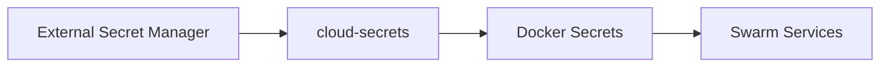

# cloud-secrets

**cloud-secrets** is a background service that synchronizes secrets from external secret managers with Docker Swarm.

It automatically detects secret changes, updates Docker Swarm secrets, and rolls out the affected services - without requiring changes to stack YAML files.

Supported cloud providers:
- [Cloud.ru Secret Manager](./docs/usage_cloudru.md)
- [HashiCorp Vault (KV v2)](./docs/usage_vault.md)

## How it works

```mermaid
flowchart LR
    A[External Secret Manager] --> B[cloud-secrets]
    B --> C[Docker Secrets]
    C --> D[Swarm Services]
```

See [Architecture](./docs/architecture.md) for the full synchronization lifecycle.

## Design goals

- External secret manager is the source of truth
- Stack files remain static
- Secret rotation requires no manual Docker operations
- Secrets are never stored in Git
- Runs natively inside Docker Swarm

## Monitoring

- [List of Prometheus metrics](./docs/monitoring.md)
- [Grafana dashboard](grafana-dashboard.json)
