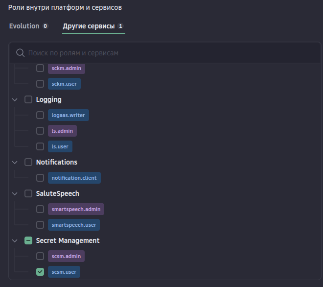

# Использование с Cloud.ru Secret Manager

[Документация по сервису Cloud.ru Secret Manager](https://cloud.ru/docs/scsm/ug/index)

<details>
  <summary>docker-compose.yaml</summary>

```yaml
version: '3.8'

services:
  cloud-secrets:
    image: swarmdeployorg/cloud-secrets:v0.1.0
    volumes:
      - "/var/run/docker.sock:/var/run/docker.sock:ro"
    environment:
      - CS_REFRESH_INTERVAL=10s
      - CLOUDRU_PROJECT_ID=<uuid>
      - CLOUDRU_IAM_CLIENT_ID=/var/run/secrets/iam_id
      - CLOUDRU_IAM_CLIENT_SECRET=/var/run/secrets/iam_secret
    secrets:
      - iam_id
      - iam_secret
    deploy:
      labels:
        - prometheus.port=8000
      placement:
        constraints:
          - node.role == manager

secrets:
  iam_id:
    external: true
  iam_secret:
    external: true
```
</details>

&raquo; &nbsp;1. Скопировать файл `docker-compose.yaml`

&raquo; &nbsp;2. Заполнить ID проекта в переменной `CLOUDRU_PROJECT_ID`.

<details>
  <summary>3. Создать сервисный аккаунт с доступом к сервису Secret Manager и ролью scsm.user</summary>
&nbsp;

[📚 Документация по созданию сервисного аккаунта](https://cloud.ru/docs/console_api/ug/topics/guides__service_accounts_create)


</details>

&raquo; &nbsp;4. Создать ключ доступа для сервисного аккаунта


<details>
  <summary>5. Полученные Key ID и Key Secret установить как секреты в кластере</summary>

```sh
echo "<client-id>" > iam_id
echo "<client-secret>" > iam_secret

docker secret create iam_id ./iam_id
docker secret create iam_secret ./iam_secret
```
</details>

<details>
  <summary>6. Задеплоить стек</summary>

```sh
docker stack deploy -c docker-compose.yaml cloud-secrets --detach=false
```
</details>
