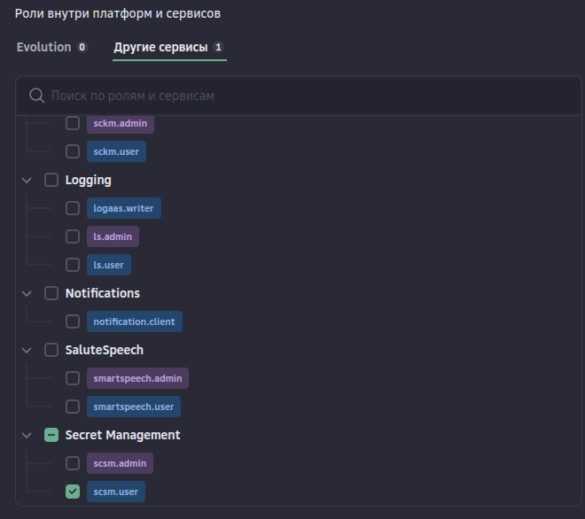

# Использование с Cloud.ru

[Документация по сервису Cloud.ru Secret Manager](https://cloud.ru/docs/scsm/ug/index)

<details>
  <summary>docker-compose.yaml</summary>

```yaml
version: '3.8'

services:
  cloud-secrets:
    image: swarmdeployorg/cloud-secrets:v0.4.0
    volumes:
      - "/var/run/docker.sock:/var/run/docker.sock:ro"
    environment:
      - CS_REFRESH_INTERVAL=10s
      - CS_SECRET_NAME_FOLDER_DELIMITER=-
      - CLOUDRU_PROJECT_ID=<uuid>
      - CLOUDRU_IAM_CLIENT_ID=/var/run/secrets/iam_id
      - CLOUDRU_IAM_CLIENT_SECRET=/var/run/secrets/iam_secret
      - CLOUDRU_ROOT_FOLDER=""
      - CLOUDRU_ROOT_FOLDER_OMIT_PREFIX=false
      # Дополнительно синхронизировать сертификаты проекта (по умолчанию false).
      - CLOUDRU_CERTIFICATE_MANAGER_ENABLED=false
      # Удаляет только managed secrets, которых больше нет в Cloud.ru
      # и которые не используются ни одним сервисом.
      - CS_CLEANUP_ORPHANED=true
    secrets:
      - iam_id
      - iam_secret
    deploy:
      labels:
        - prometheus.port=8000
      placement:
        constraints:
          - node.role == manager

secrets:
  iam_id:
    external: true
  iam_secret:
    external: true
```
</details>

&raquo; &nbsp;1. Скопировать файл `docker-compose.yaml`

&raquo; &nbsp;2. Заполнить ID проекта в переменной `CLOUDRU_PROJECT_ID`.

Опционально можно ограничить синхронизацию одной папкой и ее дочерними папками:

- `CLOUDRU_ROOT_FOLDER=prod/apps` ограничивает поиск секретов указанной папкой.
- `CLOUDRU_ROOT_FOLDER_OMIT_PREFIX=true` убирает префикс `prod/apps/` из имен секретов в Docker Swarm.

<details>
  <summary>3. Создать сервисный аккаунт с доступом к сервису Secret Manager и ролью scsm.user</summary>
&nbsp;

[📚 Документация по созданию сервисного аккаунта](https://cloud.ru/docs/console_api/ug/topics/guides__service_accounts_create)


</details>

&raquo; &nbsp;4. Создать ключ доступа для сервисного аккаунта


<details>
  <summary>5. Полученные Key ID и Key Secret установить как секреты в кластере</summary>

```sh
echo "<client-id>" > iam_id
echo "<client-secret>" > iam_secret

docker secret create iam_id ./iam_id
docker secret create iam_secret ./iam_secret
```
</details>

<details>
  <summary>6. Задеплоить стек</summary>

```sh
docker stack deploy -c docker-compose.yaml cloud-secrets --detach=false
```
</details>


## Certificate Manager

Установите `CLOUDRU_CERTIFICATE_MANAGER_ENABLED=true`, чтобы дополнительно синхронизировать
все пригодные к использованию сертификаты из проекта `CLOUDRU_PROJECT_ID`.
По умолчанию источник отключен; запросы в Certificate Manager не выполняются.
Используются тот же сервисный аккаунт, ключи IAM из смонтированных файлов и общий кеш токена.
Помимо `scsm.user`, аккаунту нужна роль `ccm.user` (или `ccm.admin`), позволяющая читать
список сертификатов, версии и приватный ключ:
[управление доступом](https://cloud.ru/docs/certificate-manager/ug/topics/access).

HTTP endpoint берется из общего discovery, когда там есть `certificate-manager`.
Если его нет, используется официальный `https://certificatemanager.api.cloud.ru`.
Опциональная переменная `CLOUDRU_CERTIFICATE_MANAGER_ADDRESS` задает HTTP endpoint явно.
`CLOUDRU_ROOT_FOLDER` и `CLOUDRU_ROOT_FOLDER_OMIT_PREFIX` применяются только к Secret Manager.

Выбирается версия с наибольшим номером среди включенных (`enabled=true`), готовых
(`VERSION_STATUS_READY` или `VERSION_STATUS_WARNING`) и неистекших версий.
Все страницы списка версий обрабатываются. Версия закрепляется в запросе приватного ключа;
обе части проверяются вместе, включая соответствие ключа сертификату и PEM всей цепочки.
Сертификаты с истекшим сроком действия или будущим `NotBefore` не синхронизируются.

Для `domain.com` создаются ровно два логических Docker Secrets:

| Имя | Содержимое |
| --- | --- |
| `certs-domain.com-crt` | Leaf-сертификат и промежуточная цепочка в PEM |
| `certs-domain.com-pk` | Приватный ключ в PEM |

Домены берутся из DNS SAN фактического leaf-сертификата; Common Name используется,
только если DNS SAN отсутствуют. Для имени домены приводятся к нижнему регистру,
удаляется завершающая точка и префикс `*.`; выбирается первый домен в лексикографическом порядке.
Таким образом, `*.domain.com` дает те же имена `certs-domain.com-crt` и `certs-domain.com-pk`.
Коллизия имен между сертификатами или с Secret Manager завершает синхронизацию ошибкой,
не допуская произвольной перезаписи. Если имя превышает лимит Docker в 64 символа
или содержит недопустимые символы, синхронизация также завершается ошибкой.

Обе части имеют общий внешний `VersionID` вида `<certificateID>-<versionNumber>`.
Ротация использует штатный суффикс версии (например, `certs-domain.com-crt-<VersionID>`;
при превышении лимита длины штатный механизм использует UUID). Сервис с обеими частями
обновляется одним вызовом Docker API. Ошибка получения или проверки любой части
возникает до обновления сервисов: сервис продолжает использовать предыдущую пару.
Данные пары загружаются и проверяются при каждом опросе, чтобы labels соответствовали payload.

В Docker Secrets передаются следующие labels:

| Label | Значение |
| --- | --- |
| `type` | `secret` для обычных секретов Cloud.ru; `certificate` для сертификатов |
| `certificate.domains` | Уникальные DNS SAN (или CN), нижний регистр, сортировка, разделитель `,`; wildcard сохраняется |
| `certificate.expires_at` | `NotAfter` leaf-сертификата в RFC3339 UTC |
| `certificate.part` | `certificate` для `-crt`, `private_key` для `-pk` |

Labels сохраняются при создании временной версии и восстановлении логического секрета.
Метаданные провайдера не могут заменить внутренние labels владения и сверки:
`logical_path`, `external_path`, `external_version_id`, `description` и пространство `cloud-secrets.*`.
Новые labels не меняют распознавание существующих managed secrets.
Секреты сертификатов участвуют в штатной ротации и очистке неиспользуемых секретов;
`CS_CLEANUP_ORPHANED=true` удаляет только отсутствующие в источнике managed secrets,
которые не использует ни один сервис.

Клиент использует только необходимые HTTP-запросы из
[официального API](https://cloud.ru/docs/certificate-manager/ug/topics/api-ref__certificate-manager),
без генерации клиентов или добавления OpenAPI-схем в репозиторий.
