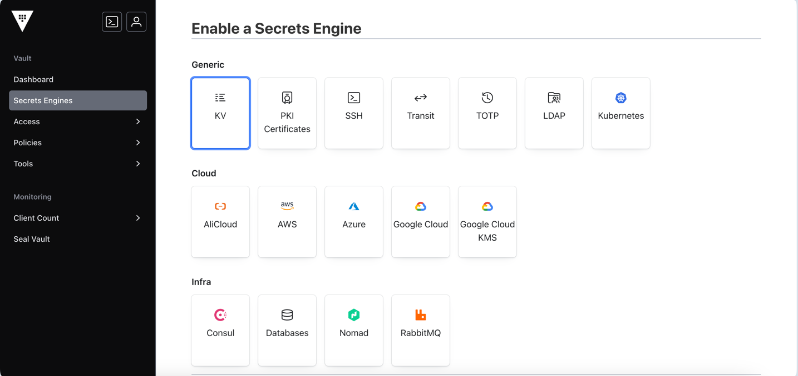
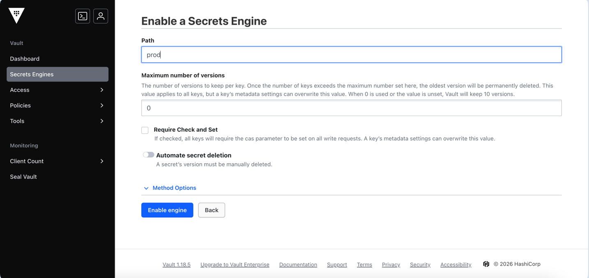
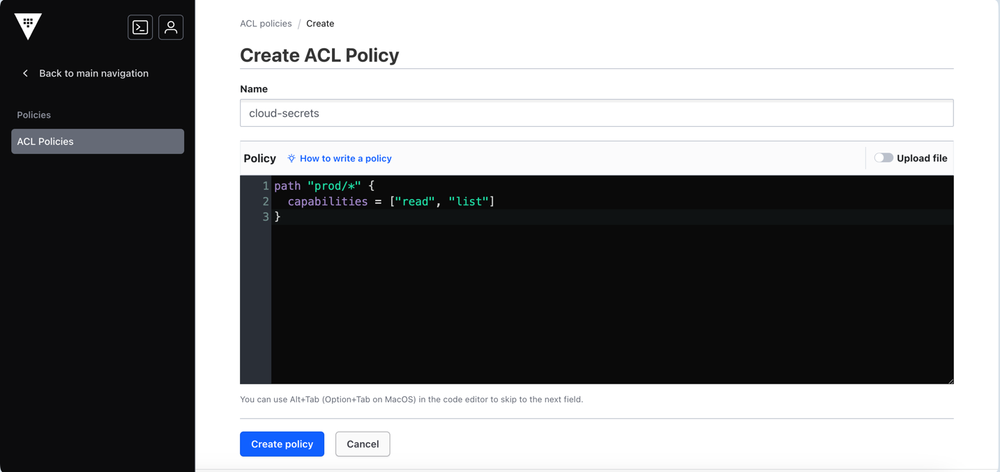

# Использование cloud-secrets с HashiCorp Vault (KV v2)

[In English](./usage_vault.md)

Как ключи Vault преобразуются в Docker Swarm secrets:
- Каждый ключ внутри одного Vault secret (`data`) синхронизируется как отдельный Docker Swarm secret.
- Это правило применяется всегда, даже если в Vault secret только один ключ.
- Указанный `VAULT_MOUNT_PATH` не включается в имя Docker Swarm secret.
- Формат внешнего пути: `<path-inside-mount>/<key>`.

> [!TIP]
> Пример: если один Vault secret создан по пути `prod/orders` и имеет ключи `db-user` и `db-password`
> 
> Тогда `prod` - это KV mount, `orders` - путь внутри mount, а `cloud-secrets` создает два секрета в Docker Swarm:
> * `orders-db-user`
> * `orders-db-password`

## Использование cloud-secrets с Vault AppRole

**Пререквизиты**

* Запущенный Vault, доступный с manager-нод Docker Swarm. В примерах ниже мы будем исходить из того, что Vault развернут в сети `vault` и доступен по адресу `vault:8200`

В инструкциях ниже мы создадим KV Engine, AppRole и секреты для работы **cloud-secrets** с Vault.

> [!IMPORTANT]
> cloud-secrets использует RoleID и SecretID только для аутентификации в Vault. 
> 
> Vault runtime token, который возвращается через AppRole, хранится в памяти и автоматически запрашивается заново при необходимости.
> 
> В примерах ниже SecretID не истекает и не имеет ограничения по числу использований. При необходимости ротируйте SecretID отдельно в соответствии с вашей security policy.


### Настройка Vault с cloud-secrets CLI

CLI выполнит следующие действия:

&raquo; Включит аутентификацию через AppRole

<details>
  <summary>Создаст ACL Policy с названием cloud-secrets</summary>

```hcl
path "mountPath/metadata" {
  capabilities = ["list"]
}

path "mountPath/metadata/*" {
  capabilities = ["read", "list"]
}

path "mountPath/data/*" {
  capabilities = ["read"]
}
```
</details>

<details>
  <summary>Создаст AppRole с названием cloud-secrets</summary>

```
name=cloud-secrets
token_policies=cloud-secrets
token_ttl=1h
token_max_ttl=4h
secret_id_ttl=0
```

</details>

<details>
  <summary>Создаст секреты в Swarm для аутентификации запросов cloud-secrets с Vault</summary>

- cloud-secrets-vault-approle-role-id
- cloud-secrets-vault-approle-secret-id
</details>

**Шаги**

<details>
  <summary>1. Создайте новый KV secrets engine в Vault</summary>

1. На странице создания Secret Engine выберите KV.



2. Укажите path `prod`.



3. Нажмите кнопку `Enable engine`.

</details>

<details>
  <summary>1. Запустите cloud-secrets CLI</summary>

Запустите следующий скрипт

```shell
docker run --rm --network=vault swarmdeployorg/cloud-secrets vault approle vault:8200 prod
```

Где:
- `vault:8200` - адрес к инстансу Vault
- `prod` - имя KV Engine

</details>

<details>
  <summary>2. Скопируйте docker-compose.yaml для cloud-secrets Stack</summary>

```yaml
version: '3.8'

services:
  cloud-secrets:
    image: swarmdeployorg/cloud-secrets:v0.4.0
    volumes:
      - "/var/run/docker.sock:/var/run/docker.sock:ro"
    environment:
      - CS_PROVIDER=vault
      - CS_REFRESH_INTERVAL=10s
      - CS_LOG_LEVEL=debug
      - VAULT_ADDR=http://vault:8200
      - VAULT_MOUNT_PATH=prod
      - VAULT_AUTH_APPROLE_ROLE_ID=/run/secrets/cloud-secrets-vault-approle-role-id
      - VAULT_AUTH_APPROLE_SECRET_ID=/run/secrets/cloud-secrets-vault-approle-secret-id
    networks:
      - vault
    secrets:
      - cloud-secrets-vault-approle-role-id
      - cloud-secrets-vault-approle-secret-id
    deploy:
      labels:
        - prometheus.port=8000
      placement:
        constraints:
          - node.role == manager

networks:
  vault:
    external: true

secrets:
  cloud-secrets-vault-approle-role-id:
    external: true
  cloud-secrets-vault-approle-secret-id:
    external: true
```

Внешняя сеть `vault` должна быть той же Swarm overlay-сетью, в которой Vault service доступен под именем `vault`.
</details>

<details>
  <summary>8. Разверните Stack</summary>

```sh
docker stack deploy -c docker-compose.yaml cloud-secrets --detach=false
```
</details>

### Ручная настройка

**Шаги**

<details>
  <summary>1. Создайте новый KV secrets engine в Vault</summary>

1. На странице создания Secret Engine выберите KV.


2. Укажите path `prod`.


3. Нажмите кнопку `Enable engine`.

</details>

<details>
  <summary>2. Создайте ACL Policy</summary>

1. Укажите Name `cloud-secrets`.
2. Укажите Policy со следующим содержимым:

```hcl
path "prod/metadata" {
  capabilities = ["list"]
}

path "prod/metadata/*" {
  capabilities = ["read", "list"]
}

path "prod/data/*" {
  capabilities = ["read"]
}
```

3. Нажмите кнопку `Create policy`.



</details>

<details>
  <summary>3. Включите AppRole authentication</summary>

Включите метод аутентификации AppRole:

```sh
vault auth enable approle
```

Если AppRole уже включен, этот шаг можно пропустить.

</details>

<details>
  <summary>4. Создайте AppRole для cloud-secrets</summary>

Создайте AppRole и привяжите к нему policy `cloud-secrets`:

```sh
vault write auth/approle/role/cloud-secrets \
  token_policies="cloud-secrets" \
  token_ttl="1h" \
  token_max_ttl="4h" \
  secret_id_ttl="0" \
  secret_id_num_uses="0"
```

</details>

<details>
  <summary>5. Получите AppRole RoleID и SecretID</summary>

Получите RoleID:

```sh
vault read -field=role_id auth/approle/role/cloud-secrets/role-id
```

Сгенерируйте SecretID:

```sh
vault write -field=secret_id -f auth/approle/role/cloud-secrets/secret-id
```

Сохраните оба значения. SecretID является секретом и не должен попадать в репозиторий.

</details>

<details>
  <summary>6. Создайте Docker Swarm Secrets для AppRole credentials</summary>

Создайте Swarm secret с RoleID:

```sh
printf %s "<ROLE_ID>" | \
  docker secret create \
    cloud-secrets-vault-approle-role-id -
```

Создайте Swarm secret с SecretID:

```sh
printf %s "<SECRET_ID>" | \
  docker secret create \
    cloud-secrets-vault-approle-secret-id -
```

Secrets будут смонтированы в контейнер `cloud-secrets` по путям:

```text
/run/secrets/cloud-secrets-vault-approle-role-id
/run/secrets/cloud-secrets-vault-approle-secret-id
```

</details>

<details>
  <summary>7. Скопируйте docker-compose.yaml для cloud-secrets Stack</summary>

```yaml
version: '3.8'

services:
  cloud-secrets:
    image: swarmdeployorg/cloud-secrets:v0.4.0
    volumes:
      - "/var/run/docker.sock:/var/run/docker.sock:ro"
    environment:
      - CS_PROVIDER=vault
      - CS_REFRESH_INTERVAL=10s
      - CS_LOG_LEVEL=debug
      - VAULT_ADDR=http://vault:8200
      - VAULT_MOUNT_PATH=prod
      - VAULT_AUTH_APPROLE_ROLE_ID=/run/secrets/cloud-secrets-vault-approle-role-id
      - VAULT_AUTH_APPROLE_SECRET_ID=/run/secrets/cloud-secrets-vault-approle-secret-id
    networks:
      - vault
    secrets:
      - cloud-secrets-vault-approle-role-id
      - cloud-secrets-vault-approle-secret-id
    deploy:
      labels:
        - prometheus.port=8000
      placement:
        constraints:
          - node.role == manager

networks:
  vault:
    external: true

secrets:
  vault-approle-role-id:
    external: true
  vault-approle-secret-id:
    external: true
```

Внешняя сеть `vault` должна быть той же Swarm overlay-сетью, в которой Vault service доступен под именем `vault`.
</details>

<details>
  <summary>8. Разверните Stack</summary>

```sh
docker stack deploy -c docker-compose.yaml cloud-secrets --detach=false
```
</details>

## Настройка с Vault Token

**Пререквизиты**

* Запущенный Vault, доступный с manager-нод Docker Swarm. В примерах ниже мы будем исходить из того, что Vault развернут в сети `vault` и доступен по адресу `vault:8200`

**Шаги**

<details>
  <summary>1. Создайте новый KV secrets engine в Vault</summary>

1. На странице создания Secret Engine выберите KV.


2. Укажите path `prod`.


3. Нажмите кнопку `Enable engine`.
</details>

<details>
  <summary>2. Создайте ACL Policy</summary>

1. Укажите Name `cloud-secrets`.
2. Укажите Policy со следующим содержимым:

```hcl
path "prod/*" {
  capabilities = ["read", "list"]
}
```

3. Нажмите кнопку `Create policy`.


</details>

<details>
  <summary>3. Создайте новый token для cloud-secrets</summary>

Внутри контейнера Vault создайте token следующей командой:

```sh
vault token create -policy=cloud-secrets
```
</details>

<details>
  <summary>4. Создайте Docker Swarm Secret для Vault Token</summary>

```sh
printf %s "root-token" > vault-auth-token
docker secret create cloud-secrets-vault-auth-token ./vault-auth-token
```
</details>

<details>
  <summary>5. Скопируйте docker-compose.yaml для cloud-secrets Stack</summary>

```yaml
version: '3.8'

services:
  cloud-secrets:
    image: swarmdeployorg/cloud-secrets:v0.4.0
    volumes:
      - "/var/run/docker.sock:/var/run/docker.sock:ro"
    environment:
      - CS_PROVIDER=vault
      - CS_REFRESH_INTERVAL=10s
      - CS_LOG_LEVEL=debug
      - VAULT_ADDR=http://vault:8200
      - VAULT_AUTH_TOKEN=/var/run/secrets/cloud-secrets-vault-auth-token
      - VAULT_MOUNT_PATH=prod
    secrets:
      - cloud-secrets-vault-auth-token
    deploy:
      labels:
        - prometheus.port=8000
      placement:
        constraints:
          - node.role == manager

secrets:
  cloud-secrets-vault-auth-token:
    external: true
```

</details>

<details>
  <summary>6. Разверните Stack</summary>

```sh
docker stack deploy -c docker-compose.yaml cloud-secrets --detach=false
```
</details>
